# Diagramas PlantUML - Sistema MVC de Gestión de Empleados

Este documento contiene todos los diagramas del sistema en formato PlantUML para generar diagramas profesionales.

## Índice de Diagramas

1. [Diagrama de Arquitectura MVC](#1-diagrama-de-arquitectura-mvc)
2. [Diagrama de Clases Principal](#2-diagrama-de-clases-principal)
3. [Diagrama de Secuencia - Login](#3-diagrama-de-secuencia---login)
4. [Diagrama de Secuencia - CRUD Empleados](#4-diagrama-de-secuencia---crud-empleados)
5. [Diagrama de Componentes](#5-diagrama-de-componentes)
6. [Diagrama de Despliegue](#6-diagrama-de-despliegue)
7. [Diagrama de Base de Datos](#7-diagrama-de-base-de-datos)
8. [Diagrama de Casos de Uso](#8-diagrama-de-casos-de-uso)
9. [Diagrama de Estados - Sesión Usuario](#9-diagrama-de-estados---sesión-usuario)
10. [Diagrama de Actividades - CRUD](#10-diagrama-de-actividades---crud)
11. [Diagrama de Flujo - Autenticación](#11-diagrama-de-flujo---autenticación)
12. [Diagrama de Red - Comunicación](#12-diagrama-de-red---comunicación)

---

## 1. Diagrama de Arquitectura MVC

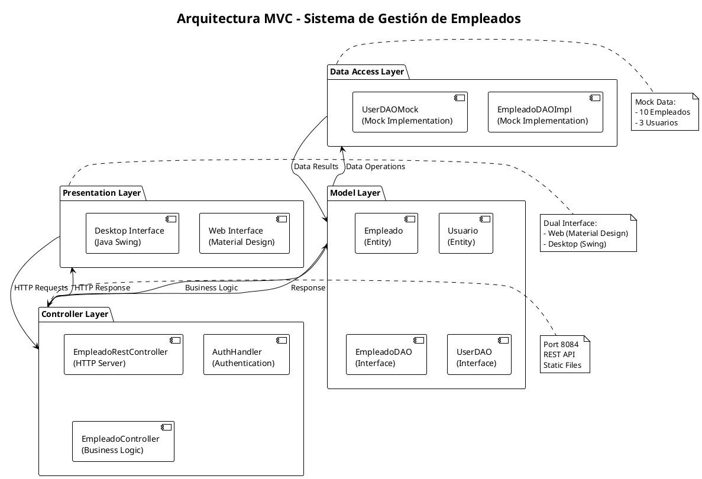

---

## 2. Diagrama de Clases Principal

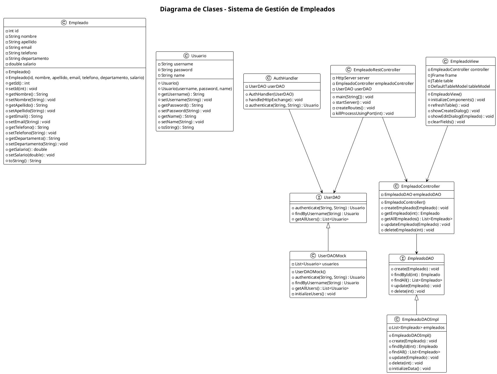

---

## 3. Diagrama de Secuencia - Login

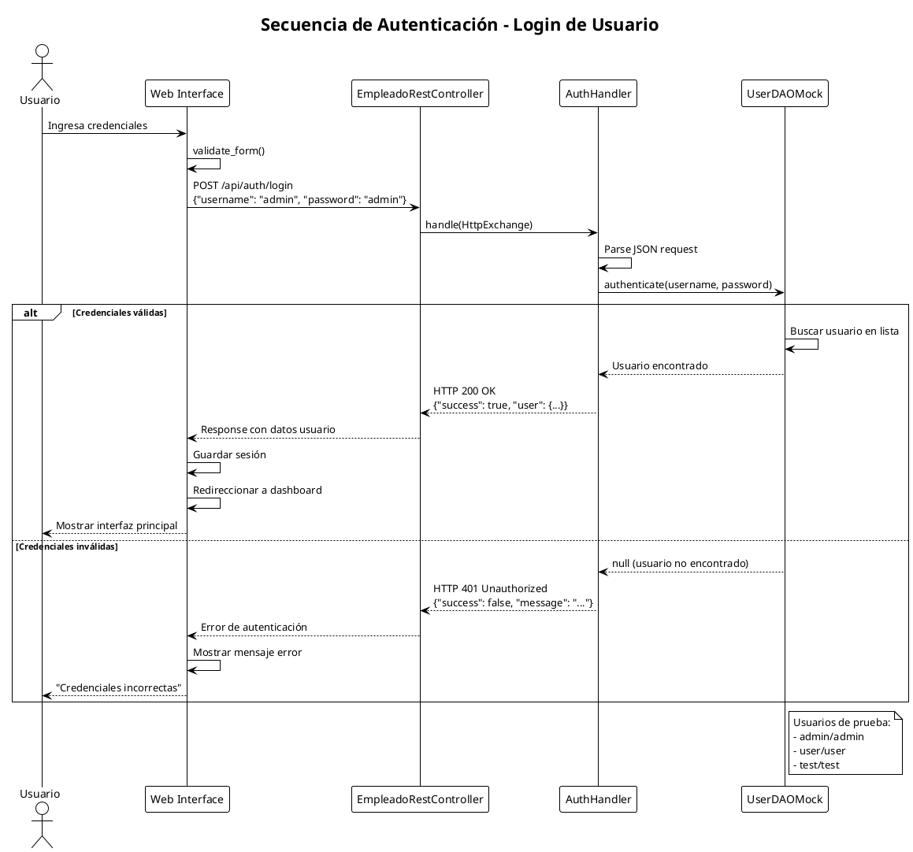

---

## 4. Diagrama de Secuencia - CRUD Empleados

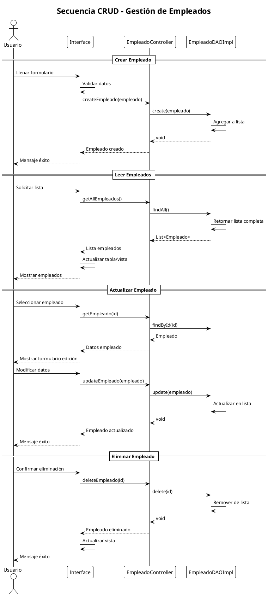

---

## 5. Diagrama de Componentes

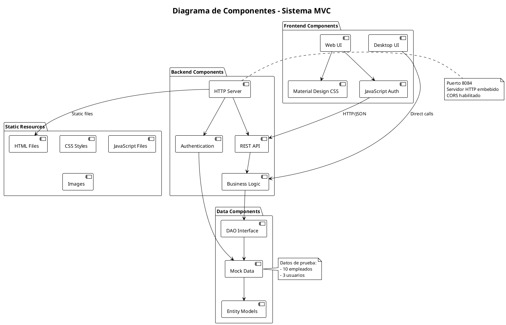

---

## 6. Diagrama de Despliegue

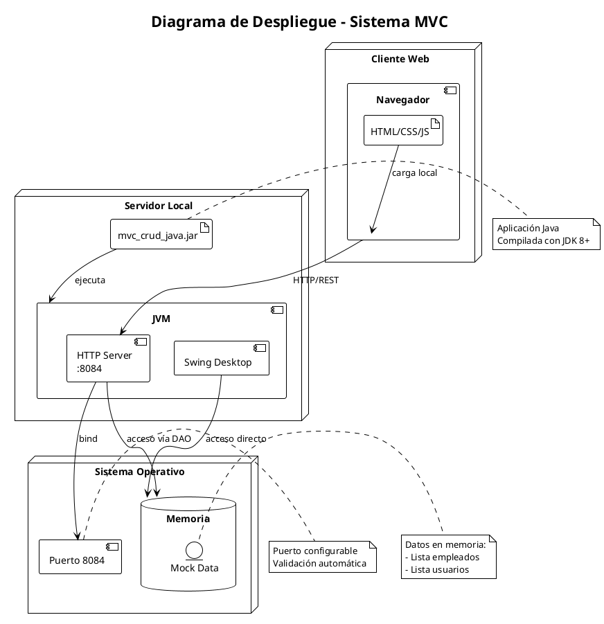

---

## 7. Diagrama de Base de Datos

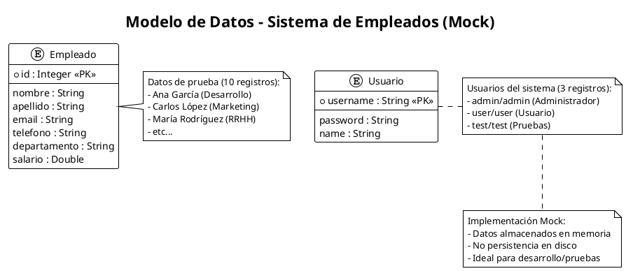

---

## 8. Diagrama de Casos de Uso

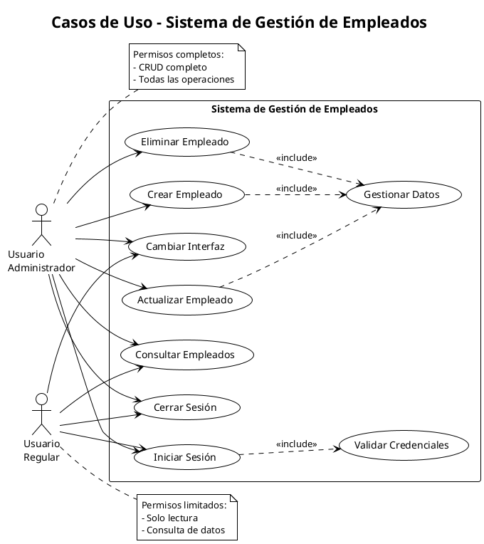

---

## 9. Diagrama de Estados - Sesión Usuario

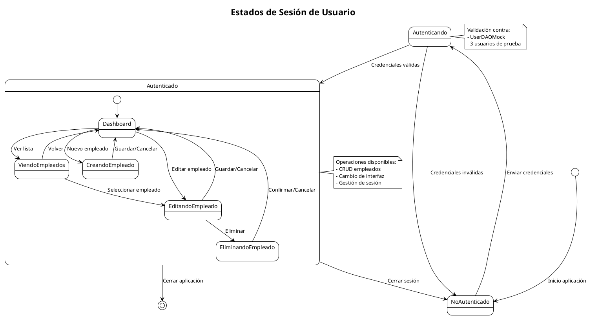

---

## 10. Diagrama de Actividades - CRUD

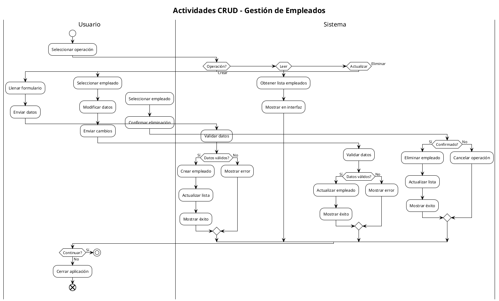

---

## 11. Diagrama de Flujo - Autenticación

```plantuml
@startuml auth_flow
!theme plain
title Flujo de Autenticación

start

:Usuario accede al sistema;
:Mostrar formulario login;

|Usuario|
:Ingresar username;
:Ingresar password;
:Hacer clic en "Login";

|Sistema|
:Recibir credenciales;
:Validar formato;

if (Formato válido?) then (No)
  :Mostrar error formato;
  stop
endif

:Buscar usuario en UserDAOMock;

if (Usuario existe?) then (No)
  :Mostrar "Usuario no encontrado";
  stop
endif

if (Password correcto?) then (No)
  :Mostrar "Contraseña incorrecta";
  stop
endif

:Crear sesión usuario;
:Guardar datos sesión;

fork
  :Mostrar interfaz web;
fork again
  :Mostrar interfaz desktop;
end fork

:Usuario autenticado;

|Usuario|
if (Cerrar sesión?) then (Sí)
  |Sistema|
  :Limpiar sesión;
  :Volver a login;
  stop
else (No)
  :Continuar usando sistema;
  end
endif

note right
  Credenciales de prueba:
  - admin / admin
  - user / user  
  - test / test
end note

@enduml
```

---

## 12. Diagrama de Red - Comunicación

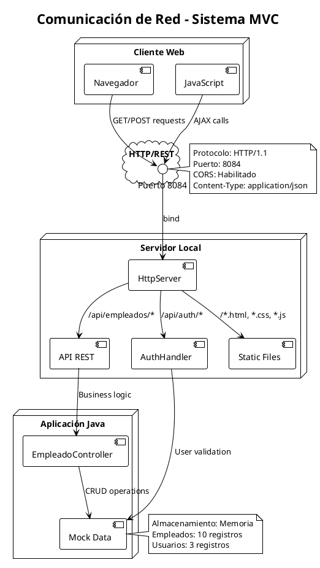

---

## Instrucciones de Uso

### 1. **Instalación PlantUML**
```bash
# Opción 1: VS Code Extension
ext install plantuml

# Opción 2: Standalone
# Descargar plantuml.jar desde http://plantuml.com
```

### 2. **Generar Diagramas**
```bash
# Método 1: VS Code
# Ctrl+Shift+P -> PlantUML: Preview Current Diagram

# Método 2: Línea de comandos
java -jar plantuml.jar diagrama.puml

# Método 3: Online
# Copiar código a http://www.plantuml.com/plantuml/
```

### 3. **Formatos de Salida**
- **PNG**: Imágenes de alta calidad
- **SVG**: Gráficos vectoriales escalables
- **PDF**: Documentos profesionales
- **LaTeX**: Integración académica

### 4. **Personalización**
```plantuml
# Temas disponibles
!theme plain
!theme bluegray
!theme materia
!theme spacelab

# Colores personalizados
skinparam backgroundColor #FAFAFA
skinparam classBackgroundColor #E8F5E8
```

---

## Notas Técnicas

- **Compatibilidad**: PlantUML requiere Java 8+
- **Rendimiento**: Diagramas complejos pueden tardar en renderizar
- **Sintaxis**: Seguir guía oficial en plantuml.com/guide
- **Versionado**: Mantener diagramas sincronizados con código

---

*Documento generado el 27 de septiembre de 2025*  
*Sistema MVC de Gestión de Empleados v1.0*