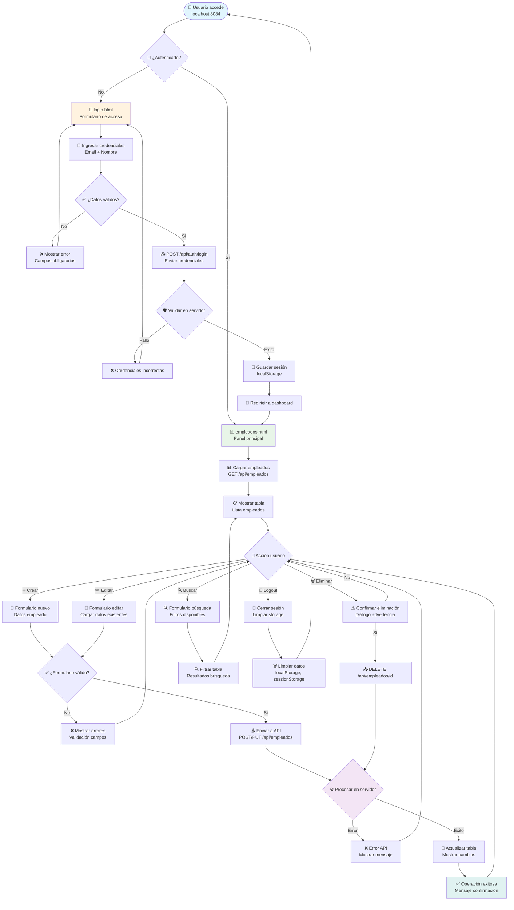
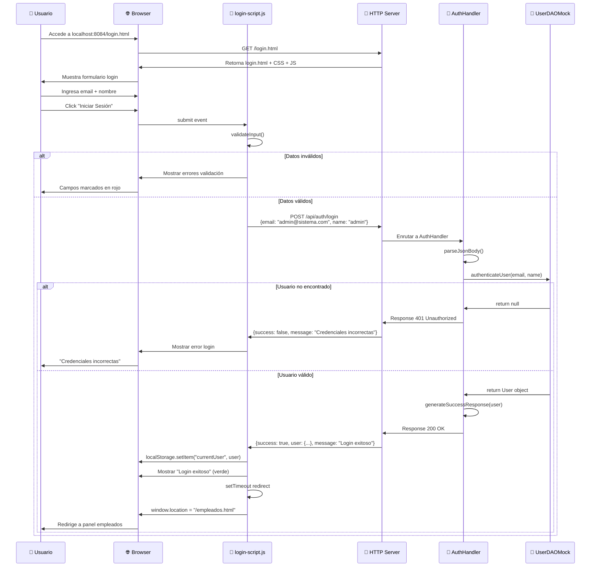
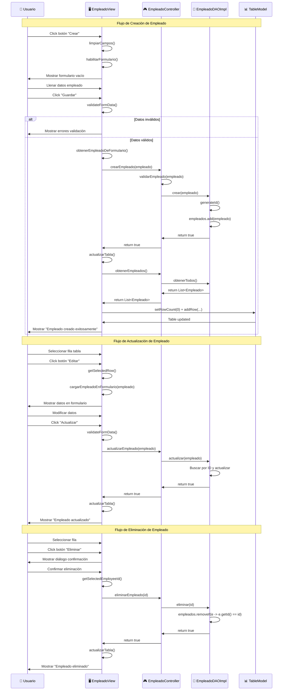
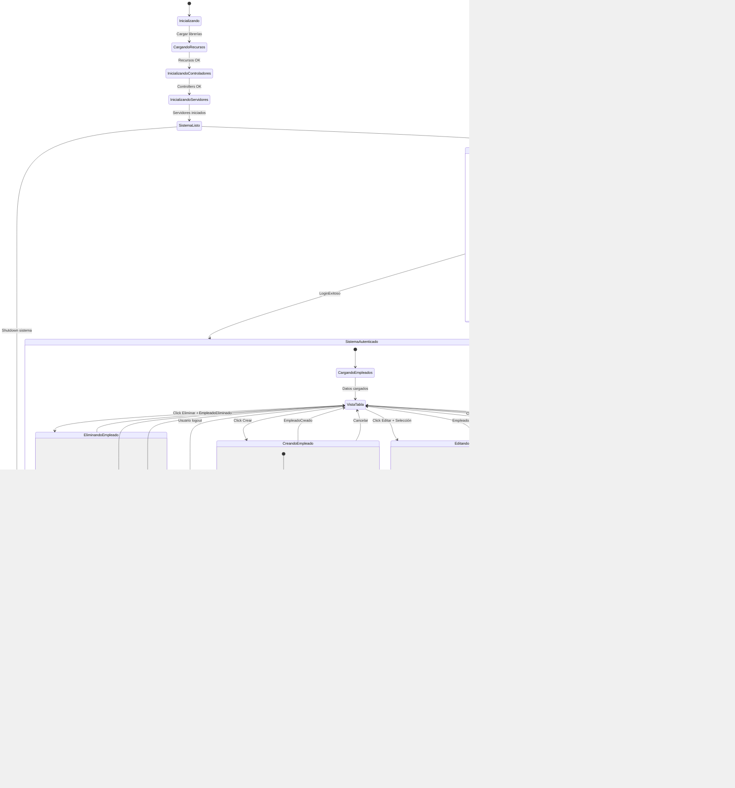

# 🏗️ DIAGRAMAS TÉCNICOS
## Sistema MVC de Gestión de Empleados

---

## 📊 **DIAGRAMA DE ARQUITECTURA GENERAL**

```
┌─────────────────────────────────────────────────────────────────────────────────┐
│                          🏢 SISTEMA MVC - EMPLEADOS                            │
│                              Puerto 8084 (Fijo)                               │
└─────────────────────────────────────────────────────────────────────────────────┘
                                        │
                        ┌───────────────┼───────────────┐
                        │               │               │
              ┌─────────▼─────────┐     │     ┌─────────▼─────────┐
              │   🌐 WEB CLIENT   │     │     │  🖥️ DESKTOP APP   │
              │                   │     │     │                   │
              │ ┌─────────────────┐ │     │     │ ┌─────────────────┐ │
              │ │   login.html    │ │     │     │ │ SupermercadoApp │ │
              │ │ empleados.html  │ │     │     │ │   EmpleadoView  │ │
              │ │ Material CSS    │ │     │     │ │   Swing GUI     │ │
              │ │ JavaScript ES6  │ │     │     │ │   JTable        │ │
              │ └─────────────────┘ │     │     │ └─────────────────┘ │
              └─────────┬─────────────┘     │     └─────────┬─────────────┘
                        │                   │               │
                        │ HTTP/REST         │               │ Direct Call
                        │                   │               │
              ┌─────────▼─────────┐         │     ┌─────────▼─────────┐
              │ 📡 HTTP SERVER    │◄────────┘     │ 🎮 MVC CONTROLLER │
              │                   │               │                   │
              │ EmpleadoRest      │──────────────▶│ EmpleadoController│
              │ Controller        │               │ LoginController   │
              │ - StaticHandler   │               │ UserController    │
              │ - AuthHandler     │               │                   │
              │ - CORS Support    │               │ Business Logic    │
              └─────────┬─────────┘               └─────────┬─────────┘
                        │                                   │
                        │            📊 MODEL LAYER         │
                        │                                   │
              ┌─────────▼─────────────────────────────────▼─────────┐
              │                💾 DATA ACCESS LAYER                │
              │                                                    │
              │ ┌─────────────────┐  ┌─────────────────────────────┐ │
              │ │ EmpleadoDAOImpl │  │        UserDAOMock          │ │
              │ │                 │  │                             │ │
              │ │ - CRUD Methods  │  │ - Authentication Data       │ │
              │ │ - Mock Data     │  │ - 3 Test Users             │ │
              │ │ - 10 Employees  │  │ - Login Validation         │ │
              │ └─────────────────┘  └─────────────────────────────┘ │
              │                                                    │
              │ ┌─────────────────────────────────────────────────┐ │
              │ │              🗄️ MODEL ENTITIES                 │ │
              │ │                                                 │ │
              │ │ Empleado:           User:                       │ │
              │ │ - id, nombre        - id, name                  │ │
              │ │ - apellido          - email                     │ │
              │ │ - email             - password                  │ │
              │ │ - telefono          - role                      │ │
              │ │ - salario           + authenticate()            │ │
              │ │ - puesto            + toJson()                  │ │
              │ │ + CRUD methods                                  │ │
              │ └─────────────────────────────────────────────────┘ │
              └────────────────────────────────────────────────────┘
                                        │
              ┌────────────────────────────────────────────────────┐
              │             🔧 INFRASTRUCTURE LAYER                │
              │                                                    │
              │ JsonUtil    DatabaseConfig    CORS Headers         │
              │ Gson API    MySQL Ready      Security Config       │
              └────────────────────────────────────────────────────┘
```

---

## 🧩 **DIAGRAMA DE COMPONENTES DETALLADO**

```mermaid
graph TB
    subgraph "🌐 Frontend Web"
        A[login.html<br/>🔐 Autenticación]
        B[empleados.html<br/>👥 Gestión CRUD]
        C[login-script.js<br/>📝 Validación]
        D[empleados-script.js<br/>⚡ API Calls]
        E[material-styles.css<br/>🎨 UI Design]
        
        A --> C
        B --> D
        C --> D
        E --> A
        E --> B
    end
    
    subgraph "🖥️ Frontend Desktop"
        F[SupermercadoApp.java<br/>🚀 Main App]
        G[EmpleadoView.java<br/>📊 GUI Table]
        H[LoginView.java<br/>🔐 Auth Dialog]
        I[UserView.java<br/>👤 User Management]
        
        F --> G
        F --> H
        H --> I
    end
    
    subgraph "📡 HTTP Server Layer"
        J[EmpleadoRestController<br/>🌐 HTTP + REST API]
        K[StaticFileHandler<br/>📁 Web Resources]
        L[AuthHandler<br/>🔐 Authentication]
        M[CORS Handler<br/>🌍 Cross-Origin]
        
        J --> K
        J --> L
        J --> M
    end
    
    subgraph "🎮 Business Logic Layer"
        N[EmpleadoController<br/>👥 Employee CRUD]
        O[LoginController<br/>🔐 Session Mgmt]
        P[UserController<br/>👤 User Operations]
        Q[AuthenticationService<br/>🛡️ Security]
        
        N --> O
        P --> Q
    end
    
    subgraph "💾 Data Access Layer"
        R[EmpleadoDAO Interface<br/>📋 Contract]
        S[EmpleadoDAOImpl<br/>🔧 Mock Implementation]
        T[UserDAO Interface<br/>👤 User Contract]
        U[UserDAOMock<br/>🧪 Test Data]
        
        R --> S
        T --> U
    end
    
    subgraph "🗄️ Model Layer"
        V[Empleado Entity<br/>👥 Employee Model]
        W[User Entity<br/>👤 Auth Model]
        X[JsonUtil<br/>🔄 Serialization]
        Y[DatabaseConfig<br/>🗃️ DB Setup]
        
        V --> X
        W --> X
    end
    
    // Conexiones entre capas
    C --> L
    D --> J
    G --> N
    H --> P
    
    J --> N
    L --> Q
    
    N --> R
    O --> T
    P --> T
    
    S --> V
    U --> W
    
    // Flujo de datos
    A -.->|"HTTP Login"| L
    B -.->|"HTTP CRUD"| J
    G -.->|"Direct Call"| N
    
    style A fill:#e1f5fe
    style B fill:#e8f5e8
    style F fill:#fff3e0
    style J fill:#fce4ec
    style N fill:#f3e5f5
    style S fill:#e0f2f1
```

---

## 📊 **DIAGRAMA DE CLASES COMPLETO**

```mermaid
classDiagram
    %% Modelo de Datos
    class Empleado {
        -int id
        -String nombre
        -String apellido
        -String email
        -String telefono
        -double salario
        -String puesto
        -Date fechaContratacion
        +Empleado()
        +Empleado(params...)
        +getId() int
        +setId(int)
        +getNombre() String
        +setNombre(String)
        +getApellido() String
        +setApellido(String)
        +getEmail() String
        +setEmail(String)
        +getTelefono() String
        +setTelefono(String)
        +getSalario() double
        +setSalario(double)
        +getPuesto() String
        +setPuesto(String)
        +toString() String
        +toJson() String
    }
    
    class User {
        -int id
        -String name
        -String email
        -String password
        -String role
        +User()
        +User(params...)
        +getId() int
        +setId(int)
        +getName() String
        +setName(String)
        +getEmail() String
        +setEmail(String)
        +getPassword() String
        +setPassword(String)
        +getRole() String
        +setRole(String)
        +authenticate(String, String) boolean
        +toJson() String
    }
    
    %% Interfaces DAO
    class EmpleadoDAO {
        <<interface>>
        +crear(Empleado) boolean
        +obtenerTodos() List~Empleado~
        +obtenerPorId(int) Empleado
        +actualizar(Empleado) boolean
        +eliminar(int) boolean
        +buscarPorNombre(String) List~Empleado~
        +buscarPorEmail(String) Empleado
    }
    
    class UserDAO {
        <<interface>>
        +getAllUsers() List~User~
        +getUserById(int) User
        +getUserByEmail(String) User
        +authenticateUser(String, String) User
        +createUser(User) boolean
        +updateUser(User) boolean
        +deleteUser(int) boolean
    }
    
    %% Implementaciones DAO
    class EmpleadoDAOImpl {
        -List~Empleado~ empleados
        -int nextId
        +EmpleadoDAOImpl()
        +crear(Empleado) boolean
        +obtenerTodos() List~Empleado~
        +obtenerPorId(int) Empleado
        +actualizar(Empleado) boolean
        +eliminar(int) boolean
        +buscarPorNombre(String) List~Empleado~
        +buscarPorEmail(String) Empleado
        -initializeMockData() void
        -generateId() int
    }
    
    class UserDAOMock {
        -List~User~ USERS
        +UserDAOMock()
        +getAllUsers() List~User~
        +getUserById(int) User
        +getUserByEmail(String) User
        +authenticateUser(String, String) User
        +createUser(User) boolean
        +updateUser(User) boolean
        +deleteUser(int) boolean
        -initializeUsers() void
    }
    
    %% Controladores
    class EmpleadoController {
        -EmpleadoDAO empleadoDAO
        +EmpleadoController()
        +EmpleadoController(EmpleadoDAO)
        +crearEmpleado(Empleado) boolean
        +obtenerEmpleados() List~Empleado~
        +obtenerEmpleadoPorId(int) Empleado
        +actualizarEmpleado(Empleado) boolean
        +eliminarEmpleado(int) boolean
        +buscarEmpleados(String) List~Empleado~
        +validarEmpleado(Empleado) boolean
    }
    
    class UserController {
        -UserDAO userDAO
        +UserController()
        +UserController(UserDAO)
        +authenticateUser(String, String) User
        +getAllUsers() List~User~
        +getUserById(int) User
        +createUser(User) boolean
        +updateUser(User) boolean
        +deleteUser(int) boolean
        +validateUserData(User) boolean
    }
    
    class LoginController {
        -UserController userController
        +LoginController()
        +login(String, String) boolean
        +logout() void
        +getCurrentUser() User
        +isUserLoggedIn() boolean
        +validateSession() boolean
    }
    
    %% Controladores REST/HTTP
    class EmpleadoRestController {
        -HttpServer server
        -EmpleadoController empleadoController
        -AuthHandler authHandler
        -int puerto
        +EmpleadoRestController()
        +main(String[]) void
        +startServer() void
        +stopServer() void
        +handleEmployeeRequest(HttpExchange) void
        +handleAuthRequest(HttpExchange) void
        +serveStaticFile(HttpExchange) void
        +setCORSHeaders(HttpExchange) void
        +killProcessUsingPort(int) void
        -parseRequestBody(HttpExchange) String
        -sendResponse(HttpExchange, String, int) void
    }
    
    class AuthHandler {
        -UserDAO userDAO
        +AuthHandler()
        +handle(HttpExchange) void
        +handleLogin(HttpExchange) void
        +handleGetUsers(HttpExchange) void
        +validateLoginData(String) boolean
        +generateLoginResponse(User) String
        +sendErrorResponse(HttpExchange, String) void
        -parseJson(String) Map
        -createSuccessResponse(User) String
    }
    
    %% Vistas
    class EmpleadoView {
        -JFrame frame
        -JTable tableEmpleados
        -JTextField txtNombre
        -JTextField txtApellido
        -JTextField txtEmail
        -JTextField txtTelefono
        -JTextField txtSalario
        -JTextField txtPuesto
        -JButton btnCrear
        -JButton btnActualizar
        -JButton btnEliminar
        -JButton btnBuscar
        -EmpleadoController controller
        -DefaultTableModel tableModel
        +EmpleadoView()
        +EmpleadoView(EmpleadoController)
        +inicializar() void
        +mostrarVentana() void
        +actualizarTabla() void
        +limpiarCampos() void
        +cargarEmpleadoEnFormulario(Empleado) void
        +obtenerEmpleadoDeFormulario() Empleado
        +mostrarMensaje(String) void
        +mostrarError(String) void
        -setupEventListeners() void
        -createTableModel() DefaultTableModel
        -validateFormData() boolean
    }
    
    class LoginView {
        -JFrame frame
        -JTextField txtEmail
        -JTextField txtNombre
        -JButton btnLogin
        -JButton btnCancel
        -LoginController controller
        +LoginView()
        +LoginView(LoginController)
        +mostrarVentana() void
        +ocultarVentana() void
        +limpiarCampos() void
        +obtenerCredenciales() String[]
        +mostrarMensajeError(String) void
        +mostrarMensajeExito(String) void
        -setupComponents() void
        -setupEventListeners() void
        -validateInput() boolean
    }
    
    class SupermercadoApp {
        -EmpleadoController empleadoController
        -EmpleadoView empleadoView
        -LoginView loginView
        -User currentUser
        +SupermercadoApp()
        +main(String[]) void
        +inicializar() void
        +mostrarLogin() void
        +mostrarSistemaEmpleados() void
        +cerrarSesion() void
        -setupSystemProperties() void
        -initializeControllers() void
        -startWebServer() void
    }
    
    %% Utilidades
    class JsonUtil {
        +toJson(Object) String
        +fromJson(String, Class) Object
        +parseJsonToMap(String) Map
        +isValidJson(String) boolean
        +formatJson(String) String
    }
    
    class DatabaseConfig {
        -String url
        -String username
        -String password
        +DatabaseConfig()
        +getConnection() Connection
        +testConnection() boolean
        +initializeDatabase() void
        +closeConnection(Connection) void
    }
    
    %% Relaciones
    EmpleadoDAO <|-- EmpleadoDAOImpl
    UserDAO <|-- UserDAOMock
    
    EmpleadoController --> EmpleadoDAO
    UserController --> UserDAO
    LoginController --> UserController
    
    EmpleadoRestController --> EmpleadoController
    EmpleadoRestController --> AuthHandler
    AuthHandler --> UserDAO
    
    EmpleadoView --> EmpleadoController
    LoginView --> LoginController
    SupermercadoApp --> EmpleadoController
    SupermercadoApp --> EmpleadoView
    SupermercadoApp --> LoginView
    
    EmpleadoDAOImpl --> Empleado
    UserDAOMock --> User
    
    EmpleadoController --> Empleado
    UserController --> User
```



---

## 🗄️ **MODELO DE DATOS DETALLADO**

### **📋 Estructura de Entidades**

```sql
-- Empleado Entity (Mock Implementation)
TABLE empleados_mock {
    id              INTEGER         PRIMARY KEY AUTO_INCREMENT,
    nombre          VARCHAR(100)    NOT NULL,
    apellido        VARCHAR(100)    NOT NULL,
    email           VARCHAR(150)    UNIQUE NOT NULL,
    telefono        VARCHAR(20)     NULL,
    salario         DECIMAL(10,2)   NOT NULL CHECK (salario > 0),
    puesto          VARCHAR(100)    NOT NULL,
    fecha_contratacion DATE        DEFAULT CURRENT_DATE,
    created_at      TIMESTAMP       DEFAULT CURRENT_TIMESTAMP,
    updated_at      TIMESTAMP       DEFAULT CURRENT_TIMESTAMP ON UPDATE CURRENT_TIMESTAMP
}

-- User Entity (Authentication)
TABLE users_mock {
    id              INTEGER         PRIMARY KEY AUTO_INCREMENT,
    name            VARCHAR(100)    NOT NULL,
    email           VARCHAR(150)    UNIQUE NOT NULL,
    password        VARCHAR(255)    NOT NULL,
    role            ENUM('admin', 'user', 'manager') DEFAULT 'user',
    active          BOOLEAN         DEFAULT TRUE,
    created_at      TIMESTAMP       DEFAULT CURRENT_TIMESTAMP,
    last_login      TIMESTAMP       NULL
}

-- Session Management (Future Implementation)
TABLE sessions {
    id              VARCHAR(255)    PRIMARY KEY,
    user_id         INTEGER         NOT NULL,
    created_at      TIMESTAMP       DEFAULT CURRENT_TIMESTAMP,
    expires_at      TIMESTAMP       NOT NULL,
    ip_address      VARCHAR(45)     NULL,
    user_agent      TEXT            NULL,
    FOREIGN KEY (user_id) REFERENCES users_mock(id) ON DELETE CASCADE
}
```

### **🔗 Relaciones entre Entidades**

```
┌─────────────────┐      ┌─────────────────┐
│      User       │      │    Session      │
│ =============== │      │ =============== │
│ • id (PK)       │─────▶│ • id (PK)       │
│ • name          │ 1..* │ • user_id (FK)  │
│ • email (UQ)    │      │ • created_at    │
│ • password      │      │ • expires_at    │
│ • role          │      │ • ip_address    │
│ • active        │      │ • user_agent    │
│ • created_at    │      └─────────────────┘
│ • last_login    │
└─────────────────┘

┌─────────────────┐      ┌─────────────────┐
│    Empleado     │      │   Auditoria     │
│ =============== │      │ =============== │
│ • id (PK)       │─────▶│ • id (PK)       │
│ • nombre        │ 1..* │ • empleado_id   │
│ • apellido      │      │ • accion        │
│ • email (UQ)    │      │ • usuario_id    │
│ • telefono      │      │ • fecha         │
│ • salario       │      │ • detalles      │
│ • puesto        │      └─────────────────┘
│ • fecha_contrat │
│ • created_at    │
│ • updated_at    │
└─────────────────┘
```

### **📊 Datos de Prueba (Mock)**

```java
// 10 Empleados Mockeados
empleados_mock = [
    {id: 1, nombre: "Ana", apellido: "García", email: "ana.garcia@email.com", 
     telefono: "555-0101", salario: 65000.00, puesto: "Gerente de Ventas"},
    {id: 2, nombre: "Luis", apellido: "Martínez", email: "luis.martinez@email.com",
     telefono: "555-0102", salario: 45000.00, puesto: "Vendedor Senior"},
    {id: 3, nombre: "Carmen", apellido: "López", email: "carmen.lopez@email.com",
     telefono: "555-0103", salario: 38000.00, puesto: "Cajera Principal"},
    // ... 7 empleados más
];

// 3 Usuarios de Autenticación
users_mock = [
    {id: 1, name: "admin", email: "admin@sistema.com", 
     password: "admin123", role: "admin"},
    {id: 2, name: "user", email: "user@sistema.com",
     password: "password", role: "user"},
    {id: 3, name: "test", email: "test@sistema.com",
     password: "test123", role: "user"}
];
```

---

## 🌐 **DIAGRAMA DE FLUJO - INTERFAZ WEB**



---

## 🖥️ **DIAGRAMA DE FLUJO - INTERFAZ DESKTOP**

```mermaid
flowchart TD
    StartApp([☕ Iniciar SupermercadoApp.java]) --> InitComponents[🔧 Inicializar componentes<br/>Controllers + DAOs]
    
    InitComponents --> ShowLogin[🔐 Mostrar LoginView<br/>Ventana autenticación]
    
    ShowLogin --> EnterCreds[👤 Ingresar credenciales<br/>Email + Nombre]
    EnterCreds --> ValidateCreds{✅ ¿Credenciales válidas?}
    
    ValidateCreds -->|No| LoginFailed[❌ Login fallido<br/>Mostrar error]
    LoginFailed --> ShowLogin
    
    ValidateCreds -->|Sí| AuthSuccess[✅ Autenticación exitosa<br/>Guardar usuario actual]
    AuthSuccess --> HideLogin[🫥 Ocultar LoginView]
    HideLogin --> ShowMainApp[🖥️ Mostrar EmpleadoView<br/>Ventana principal]
    
    ShowMainApp --> LoadData[📊 Cargar datos<br/>empleadoController.obtenerEmpleados()]
    LoadData --> PopulateTable[📋 Poblar JTable<br/>DefaultTableModel]
    PopulateTable --> ShowInterface[🎯 Mostrar interfaz<br/>Lista + Formulario + Botones]
    
    ShowInterface --> UserAction{🎯 Acción usuario}
    
    UserAction -->|➕ Crear| EnableForm[📝 Habilitar formulario<br/>Limpiar campos]
    UserAction -->|✏️ Editar| SelectRow{📋 ¿Fila seleccionada?}
    UserAction -->|🗑️ Eliminar| SelectRowDel{📋 ¿Fila seleccionada?}
    UserAction -->|🔍 Buscar| ShowSearchDialog[🔍 Diálogo búsqueda<br/>Criterios filtrado]
    UserAction -->|💾 Guardar| ValidateFormData{✅ ¿Datos válidos?}
    UserAction -->|🔄 Actualizar| RefreshData[🔄 Recargar datos<br/>Actualizar tabla]
    UserAction -->|🚪 Salir| ConfirmExit[⚠️ ¿Confirmar salida?<br/>Guardar cambios?]
    
    SelectRow -->|No| NoSelection[❌ Sin selección<br/>Mostrar advertencia]
    NoSelection --> UserAction
    
    SelectRow -->|Sí| LoadToForm[📝 Cargar datos<br/>Fila → Formulario]
    LoadToForm --> EnableEdit[✏️ Habilitar edición<br/>Botón "Actualizar"]
    EnableEdit --> UserAction
    
    SelectRowDel -->|No| NoSelection
    SelectRowDel -->|Sí| ConfirmDelete[⚠️ ¿Confirmar eliminación?<br/>Diálogo confirmación]
    
    ConfirmDelete -->|No| UserAction
    ConfirmDelete -->|Sí| DeleteEmployee[🗑️ Eliminar empleado<br/>controller.eliminarEmpleado(id)]
    DeleteEmployee --> CheckDeleteResult{✅ ¿Eliminación exitosa?}
    
    CheckDeleteResult -->|No| DeleteError[❌ Error eliminación<br/>Mostrar mensaje error]
    DeleteError --> UserAction
    
    CheckDeleteResult -->|Sí| DeleteSuccess[✅ Eliminación exitosa<br/>Mostrar confirmación]
    DeleteSuccess --> RefreshTableDel[🔄 Actualizar tabla<br/>Remover fila]
    RefreshTableDel --> ClearForm[🗑️ Limpiar formulario]
    ClearForm --> UserAction
    
    ValidateFormData -->|No| FormValidationError[❌ Errores validación<br/>Mostrar campos incorrectos]
    FormValidationError --> UserAction
    
    ValidateFormData -->|Sí| GetFormData[📝 Obtener datos<br/>Formulario → Empleado objeto]
    GetFormData --> CheckOperation{🔍 ¿Crear o actualizar?}
    
    CheckOperation -->|Crear| CreateEmployee[➕ Crear empleado<br/>controller.crearEmpleado()]
    CheckOperation -->|Actualizar| UpdateEmployee[✏️ Actualizar empleado<br/>controller.actualizarEmpleado()]
    
    CreateEmployee --> CheckCreateResult{✅ ¿Creación exitosa?}
    UpdateEmployee --> CheckUpdateResult{✅ ¿Actualización exitosa?}
    
    CheckCreateResult -->|No| CreateError[❌ Error creación<br/>Mostrar mensaje]
    CreateError --> UserAction
    
    CheckCreateResult -->|Sí| CreateSuccess[✅ Empleado creado<br/>Mostrar confirmación]
    CreateSuccess --> RefreshTableCreate[🔄 Actualizar tabla<br/>Agregar nueva fila]
    RefreshTableCreate --> ClearFormCreate[🗑️ Limpiar formulario]
    ClearFormCreate --> UserAction
    
    CheckUpdateResult -->|No| UpdateError[❌ Error actualización<br/>Mostrar mensaje]
    UpdateError --> UserAction
    
    CheckUpdateResult -->|Sí| UpdateSuccess[✅ Empleado actualizado<br/>Mostrar confirmación]
    UpdateSuccess --> RefreshTableUpdate[🔄 Actualizar tabla<br/>Actualizar fila]
    RefreshTableUpdate --> UserAction
    
    ShowSearchDialog --> EnterSearchCriteria[🔍 Ingresar criterios<br/>Nombre, email, puesto, etc.]
    EnterSearchCriteria --> ExecuteSearch[🔍 Ejecutar búsqueda<br/>controller.buscarEmpleados()]
    ExecuteSearch --> FilterTable[📋 Filtrar tabla<br/>Mostrar resultados]
    FilterTable --> ShowFilteredResults[📊 Resultados filtrados<br/>Resaltar coincidencias]
    ShowFilteredResults --> UserAction
    
    RefreshData --> LoadData
    
    ConfirmExit -->|No| UserAction
    ConfirmExit -->|Sí| SavePendingChanges[💾 ¿Guardar cambios?<br/>Datos pendientes]
    SavePendingChanges --> CloseApp[🚪 Cerrar aplicación<br/>System.exit(0)]
    
    CloseApp --> End([🔚 Aplicación cerrada])
    
    style StartApp fill:#e1f5fe
    style ShowLogin fill:#fff3e0
    style ShowMainApp fill:#e8f5e8
    style CreateSuccess fill:#e0f2f1
    style UpdateSuccess fill:#e0f2f1
    style DeleteSuccess fill:#e0f2f1
```

---

## 🔄 **DIAGRAMA DE SECUENCIA - LOGIN WEB**



---

## 🔄 **DIAGRAMA DE SECUENCIA - CRUD EMPLEADOS**



---

## 📊 **DIAGRAMA DE ESTADOS - APLICACIÓN**



---

## 📋 **DIAGRAMA DE CASOS DE USO**

```mermaid
flowchart LR
    subgraph "🏢 Sistema de Gestión de Empleados"
        subgraph "👤 Actores"
            Admin[👨‍💼 Administrador]
            User[👤 Usuario]
            Sistema[⚙️ Sistema]
        end
        
        subgraph "🔐 Autenticación"
            Login[🔐 Iniciar Sesión]
            Logout[🚪 Cerrar Sesión]
            ValidarCredenciales[✅ Validar Credenciales]
        end
        
        subgraph "👥 Gestión de Empleados"
            CrearEmpleado[➕ Crear Empleado]
            VerEmpleados[👁️ Ver Lista Empleados]
            EditarEmpleado[✏️ Editar Empleado]
            EliminarEmpleado[🗑️ Eliminar Empleado]
            BuscarEmpleado[🔍 Buscar Empleado]
            ExportarDatos[📊 Exportar Datos]
        end
        
        subgraph "📊 Reportes y Consultas"
            GenerarReporte[📈 Generar Reportes]
            ConsultarSalarios[💰 Consultar Salarios]
            EstadisticasEmpleados[📊 Estadísticas]
        end
        
        subgraph "⚙️ Administración"
            GestionarUsuarios[👥 Gestionar Usuarios]
            ConfigurarSistema[⚙️ Configurar Sistema]
            AuditarActividad[🔍 Auditar Actividad]
            RespaldoDatos[💾 Respaldar Datos]
        end
        
        subgraph "🖥️ Interfaces"
            InterfazWeb[🌐 Interfaz Web]
            InterfazDesktop[🖥️ Interfaz Desktop]
        end
        
        %% Relaciones Administrador
        Admin --> Login
        Admin --> CrearEmpleado
        Admin --> EditarEmpleado
        Admin --> EliminarEmpleado
        Admin --> GestionarUsuarios
        Admin --> ConfigurarSistema
        Admin --> AuditarActividad
        Admin --> RespaldoDatos
        
        %% Relaciones Usuario
        User --> Login
        User --> VerEmpleados
        User --> BuscarEmpleado
        User --> EditarEmpleado
        User --> ConsultarSalarios
        
        %% Relaciones Sistema
        Sistema --> ValidarCredenciales
        Sistema --> GenerarReporte
        Sistema --> EstadisticasEmpleados
        Sistema --> ExportarDatos
        
        %% Extends/Includes
        Login --> ValidarCredenciales
        CrearEmpleado --> VerEmpleados
        EditarEmpleado --> VerEmpleados
        EliminarEmpleado --> VerEmpleados
        BuscarEmpleado --> VerEmpleados
        
        %% Acceso a interfaces
        Admin --> InterfazWeb
        Admin --> InterfazDesktop
        User --> InterfazWeb
        User --> InterfazDesktop
        
        %% Logout para todos
        Admin --> Logout
        User --> Logout
    end
    
    style Admin fill:#ffebee
    style User fill:#e3f2fd
    style Sistema fill:#f3e5f5
    style Login fill:#e8f5e8
    style CrearEmpleado fill:#e0f2f1
    style InterfazWeb fill:#e1f5fe
    style InterfazDesktop fill:#fff3e0
```



---

## 📱 **PROTOTIPO DE INTERFACES**

### **🌐 Interfaz Web - Login**
```
┌─────────────────────────────────────────────────────┐
│ 🏢 Sistema de Gestión - Supermercado MVC            │
├─────────────────────────────────────────────────────┤
│                                                     │
│            🏢 SISTEMA DE GESTIÓN                    │
│               Supermercado MVC                      │
│                                                     │
│   ┌─────────────────────────────────────────────┐   │
│   │           🔐 INICIAR SESIÓN                 │   │
│   │                                             │   │
│   │  📧 Email:                                  │   │
│   │  [admin@sistema.com________________]        │   │
│   │                                             │   │
│   │  👤 Nombre:                                 │   │
│   │  [admin________________________]           │   │
│   │                                             │   │
│   │  [🔐 Iniciar Sesión]  [🔄 Limpiar]        │   │
│   │                                             │   │
│   │  ✅ Login exitoso                           │   │ 
│   │                                             │   │
│   └─────────────────────────────────────────────┘   │
│                                                     │
│  💡 Usuarios disponibles:                          │
│     • admin@sistema.com / admin                     │
│     • user@sistema.com / user                       │
│     • test@sistema.com / test                       │
│                                                     │
└─────────────────────────────────────────────────────┘
```

### **🌐 Interfaz Web - Gestión de Empleados**
```
┌─────────────────────────────────────────────────────────────────────────────────┐
│ 🏢 Sistema de Gestión de Empleados              👤 admin | 🚪 Cerrar Sesión    │
├─────────────────────────────────────────────────────────────────────────────────┤
│                                                                                 │
│  [➕ Nuevo Empleado] [🔍 Buscar______] [📊 Filtros ▼] [📥 Exportar]           │
│                                                                                 │
│  ┌─────────────────────────────────────────────────────────────────────────────┐ │
│  │ ID │ Nombre        │ Apellido    │ Email              │ Puesto      │ 💰     │ │
│  ├────┼───────────────┼─────────────┼────────────────────┼─────────────┼────────┤ │
│  │ 1  │ Ana           │ García      │ ana.garcia@...     │ Gerente     │$65,000 │ │
│  │ 2  │ Luis          │ Martínez    │ luis.martinez@...  │ Vendedor    │$45,000 │ │
│  │ 3  │ Carmen        │ López       │ carmen.lopez@...   │ Cajera      │$38,000 │ │
│  │ 4  │ Pedro         │ González    │ pedro.gonzalez@... │ Supervisor  │$52,000 │ │
│  │ 5  │ María         │ Rodríguez   │ maria.rodriguez@...│ Vendedora   │$41,000 │ │
│  └────┴───────────────┴─────────────┴────────────────────┴─────────────┴────────┘ │
│                                                                                 │
│  📊 Mostrando 5 de 10 empleados                    [← Anterior] [Siguiente →] │
│                                                                                 │
│  ┌─── 📝 Formulario de Empleado ────────────────────────────────────────────┐  │
│  │ 👤 Nombre: [Juan_______________] 📧 Email: [juan.perez@email.com_____]   │  │
│  │ 👤 Apellido: [Pérez____________] 📞 Tel: [555-1234_______________]       │  │
│  │ 💼 Puesto: [Desarrollador______] 💰 Salario: [$45,000.00_______]        │  │
│  │                                                                           │  │
│  │ [✅ Guardar Empleado] [✏️ Actualizar] [🗑️ Eliminar] [🔄 Limpiar]        │  │
│  └───────────────────────────────────────────────────────────────────────────┘  │
│                                                                                 │
└─────────────────────────────────────────────────────────────────────────────────┘
```

### **🖥️ Interfaz Desktop - Aplicación Swing**
```
┌─────────────────────────────────────────────────────────────────────────────────┐
│ ☕ Sistema de Gestión de Empleados                                    [─][□][✕] │
├─────────────────────────────────────────────────────────────────────────────────┤
│ Archivo  Editar  Ver  Herramientas  Ayuda                                       │
├─────────────────────────────────────────────────────────────────────────────────┤
│                                                                                 │
│ [➕ Crear] [✏️ Editar] [🗑️ Eliminar] [🔍 Buscar] [🔄 Actualizar] [📊 Reportes] │
│                                                                                 │
│ ┌─────────────────────────────────────────────────────────────────────────────┐ │
│ │ ID │ Nombre     │ Apellido   │ Email               │ Teléfono   │ Salario    │ │
│ ├────┼────────────┼────────────┼─────────────────────┼────────────┼────────────┤ │
│ │ 1  │ Ana        │ García     │ ana.garcia@email... │ 555-0101   │ $65,000.00 │◄│
│ │ 2  │ Luis       │ Martínez   │ luis.martinez@em... │ 555-0102   │ $45,000.00 │ │
│ │ 3  │ Carmen     │ López      │ carmen.lopez@ema... │ 555-0103   │ $38,000.00 │ │
│ │ 4  │ Pedro      │ González   │ pedro.gonzalez@e... │ 555-0104   │ $52,000.00 │ │
│ │ 5  │ María      │ Rodríguez  │ maria.rodriguez@... │ 555-0105   │ $41,000.00 │ │
│ │ 6  │ José       │ Hernández  │ jose.hernandez@e... │ 555-0106   │ $47,000.00 │ │
│ │ 7  │ Laura      │ Jiménez    │ laura.jimenez@em... │ 555-0107   │ $39,000.00 │ │
│ └────┴────────────┴────────────┴─────────────────────┴────────────┴────────────┘ │
│                                                                      ▲ │ ▼     │
│ ┌─── Datos del Empleado ───────────────────────────────────────────────────────┐ │
│ │ ID: [1____]  👤 Nombre: [Ana__________] 👤 Apellido: [García__________]      │ │
│ │ 📧 Email: [ana.garcia@email.com_________________________]                    │ │
│ │ 📞 Teléfono: [555-0101________] 💼 Puesto: [Gerente de Ventas__________]      │ │
│ │ 💰 Salario: [$65,000.00______] 📅 Fecha: [15/03/2023___________]            │ │
│ │                                                                               │ │
│ │ [💾 Guardar] [🔄 Actualizar] [🆕 Nuevo] [❌ Cancelar]                        │ │
│ └───────────────────────────────────────────────────────────────────────────────┘ │
│                                                                                 │
│ Estado: ✅ Empleado seleccionado: Ana García                   📊 Total: 10     │
└─────────────────────────────────────────────────────────────────────────────────┘
```

---

**📚 Documentación Técnica Completa generada el:** Septiembre 27, 2025  
**🏗️ Diagramas incluidos:** Arquitectura, Componentes, Clases, Flujo, Estados, Casos de Uso  
**🎯 Estado del proyecto:** ✅ Completamente documentado y funcional  
**🔄 Última actualización:** Sistema MVC operativo con login reparado definitivamente